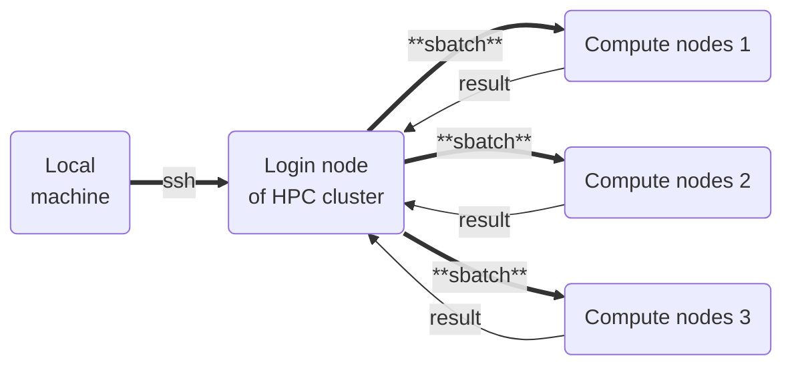
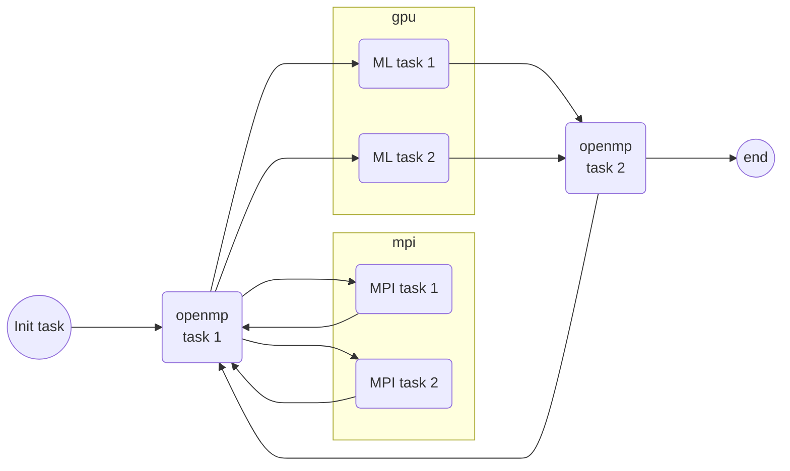

# workflow-exp
Repository for experimenting with workflow orchestrators for heterogeneous HPC applications

We have been looking at [covalent](https://www.covalent.xyz/) workflow orchestrator to test out the feasibility to run HPC workflows.

The documentation of covalent is detailed [here](https://docs.covalent.xyz/). Below is the basis setup guide for using it in your own hpc setting.

## Overivew of a workflow

The traditional setup for most HPC system looks like the following -

Where we have a local machine, from which we login to the login node of
an HPC cluster (such as Boyle, or Lanczos in Prof. Stefano's group
or meluxina for users of ICHEC). We then submit our computational tasks as
slurm jobs, as most HPC systems are configured to be used via SLURM.

SLURM allocations are usually setup to allocate entire compute nodes
rather than cpu cores within a node, so often one has to **fit** a task within node allocation.

One can **loop through** such workflows via shell scripting and slurm for high throughput
calculations, within a given HPC system. However, if a workflow has several heterogeneous
tasks, and the user has access to multiple HPC systems, one needs a tool that can bridge
between different HPC systems, and handle different types of tasks.

> Example

Say we have access to two different HPC systems, `HPC1` and `HPC2`, and both have slurm setup
with partitions containing CPUs and GPUs, albeit different cores per node, and GPU specifications.
One might have a workflow like the following -

We can see that the MPI tasks 1 and 2, and the ML tasks 1 and 2 can run
simulatneously, and if the loop from openmp task1 to MPI/ML to openmp
is static, one can fit/run this as well on a single HPC system