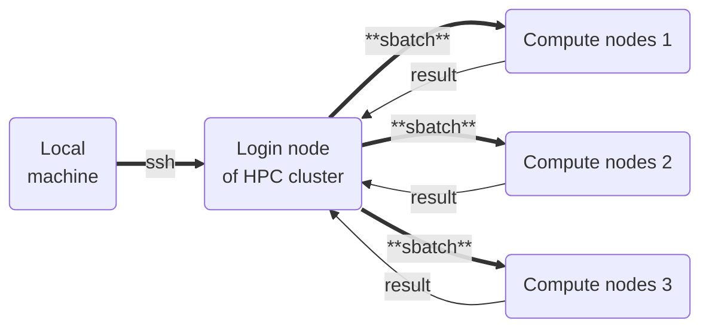
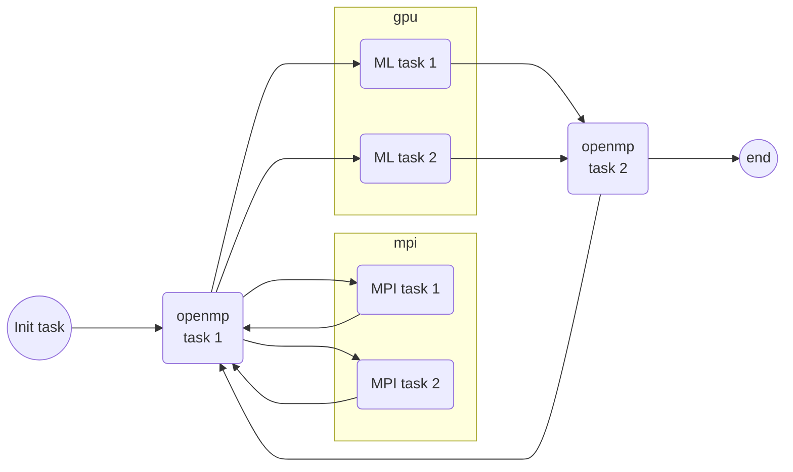

# workflow-exp
Repository for experimenting with workflow orchestrators for heterogeneous HPC applications

We have been looking at [covalent](https://www.covalent.xyz/) workflow orchestrator to test out the feasibility to run HPC workflows.

The documentation of covalent is detailed [here](https://docs.covalent.xyz/). Below is the basis setup guide for using it in your own hpc setting.

## Overivew of a workflow

The traditional setup for most HPC system looks like the following -



Where we have a local machine, from which we login to the login node of
an HPC cluster (such as Boyle, or Lanczos in Prof. Stefano's group
or meluxina for users of ICHEC). We then submit our computational tasks as
slurm jobs, as most HPC systems are configured to be used via SLURM.

SLURM allocations are usually setup to allocate entire compute nodes
rather than cpu cores within a node, so often one has to **fit** a task within node allocation.

One can **loop through** such workflows via shell scripting and slurm for high throughput
calculations, within a given HPC system. However, if a workflow has several heterogeneous
tasks, and the user has access to multiple HPC systems, one needs a tool that can bridge
between different HPC systems, and handle different types of tasks.

> Example

Say we have access to two different HPC systems, `HPC1` and `HPC2`, and both have slurm setup
with partitions containing CPUs and GPUs, albeit different cores per node, and GPU specifications.
One might have a workflow like the following -



We can see that the MPI tasks 1 and 2, and the ML tasks 1 and 2 can run
simultaneously, and if the loop from openmp task1 to MPI/ML to openmp
is static, one can fit/run this as well on a single HPC system.

However, if the loops are dynamic, and or we want to utilise access to
different HPC systems, then we need something that can manage launching
jobs on different system. Such a systems are often referred to as workflow orchestrators.

## Covalent

[Covalent](www.covalent.xyz) is one such workflow orchestrator. Even though it looks to me that
its major development is geared towards cloud based computations. See the [documentation](https://docs.covalent.xyz/).

Here is how we can use it. First, create a virtual python environment, using [conda](https://docs.conda.io/projects/conda/en/latest/user-guide/getting-started.html) or [micromamba](https://mamba.readthedocs.io/en/latest/user_guide/micromamba.html) on you local machine from where you will launch your calculations and run your workflow. The latest python covalent seems to support is 3.10, so we create the virtual environment named `wf` (or whatever you choose) with python 3.10. Then inside this bare environment we install covalent using `pip`.

```bash
# using conda
conda create -n wf python=3.10

conda activate wf
pip install covalent
```

```bash
# or using micromamba
micromamba create -n wf python=3.10
micromamba activate wf
pip install covalent
```

Covalent provides python decorators, which wrap around a python function to be able to launch in desired settings. It also has python classes called `Executors` which define where and how a python function will be executed.
Some simple executors are installed with covalent, but others can be installed via covalent plugins. There are two executors of our interest for HPC calculation

- SSH executor: which sends your calculation over ssh to another node to perform computation, and then fetch the result. One can use it for a machine with direct ssh access.
- SLURM executor: which submits a function execution as a slurm job to a cluster.

These two plugins are little outdated, so we forked them to make some changes suitable for ICHEC users. The forks are located at following -

- https://github.com/rajarshitiwari/covalent-ssh-plugin
- https://github.com/rajarshitiwari/covalent-slurm-plugin

You need to install these in the `wf` environment. To do that, download both the repositories. Then create another virtual environment named `bld` (or whatever you choose) with build package.
```bash
# or using micromamba
micromamba create -n bld python=3.10 build
micromamba activate bld
# now go to the repositories, and rub build
cd ./path-to-git-repo-covalent-ssh-plugin
python -m build
cd ./path-to-git-repo-covalent-slurm-plugin
python -m build
```

After this, the python wheels will be built in both repositories in a folder called `dist` for the corresponding packages. Then we just install them in `wf` invironment.

```bash
# First deactivte bld
micromamba deactivate
micromamba activate wf
# now go to ssh plugin repository
cd ./path-to-git-repo-covalent-ssh-plugin
pip install dist/covalent_ssh_plugin-0.24.2-py3-none-any.whl
# now go inside the slurm repository
cd ./path-to-git-repo-covalent-slurm-plugin
pip install dist/covalent_slurm_plugin-0.18.0-py3-none-any.whl
```
The versions may change, so use the filepath for the version that are build in the dist folder.

Next, you have to do the same exercsie for the remote machine at which the jobs will be run. Normally this is just the login node of the cluster you want to launch the job to.
With these steps, one is ready to use the covalent. 